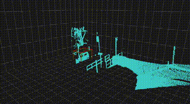
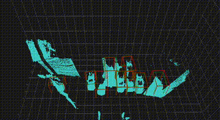
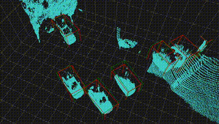

# Real-Time 3D Object Detection Using InnovizOne LiDAR and Low-Power Hailo-8 AI Accelerator

Itay Krispin-Avraham, Roy Orfaig, and Ben-Zion Bobrovsky

[**Paper**](https://arxiv.org/abs/2206.14651)
## Abstract

*Object detection is a significant field in autonomous driving. Popular sensors for this task include cameras and LiDAR sensors. LiDAR sensors offer several advantages, such as insensitivity to light changes, like in a dark setting and the ability to provide 3D information in the form of point clouds, which include the ranges of objects. However, 3D detection methods, such as PointPillars, typically require high-power hardware. Additionally, most common spinning LiDARs are sparse and may not achieve the desired quality of object detection in front of the car. In this paper, we present the feasibility of performing real-time 3D object detection of cars using 3D point clouds from a LiDAR sensor, processed and deployed on a low-power Hailo-8 AI accelerator. The LiDAR sensor used in this study is the InnovizOne sensor, which captures objects in higher quality compared to spinning LiDAR techniques, especially for distant objects. We successfully achieved real-time inference at a rate of approximately 5Hz with a high accuracy of 0.91% F1 score, with only -0.2% degradation compared to running the same model on an NVIDIA GeForce RTX 2080 Ti. This work demonstrates that effective real-time 3D object detection can be achieved on low-cost, low-power hardware, representing a significant step towards more accessible autonomous driving technologies.*

## Introduction
This project demonstrates the capability of achieving accurate 3D object detection using low-power chips. We utilized a dataset created from our own recordings with an InnovizOne LiDAR to train the PointPillars model via the OpenPCDet framework. Real-time inference was then performed using our low-power Hailo-8 AI accelerator.

In this repository, you will find our modified configuration for the model, the model's weights, a script for real-time inference using Innoviz data and other relevant resources. This is based on Hailo's great usage example which is available in their application code examples page: [Hailo Application Code Examples](https://github.com/hailo-ai/Hailo-Application-Code-Examples/tree/main).

### Examples

## Usage
Under the ``model`` folder you will find the ``results.pkl`` file of the model on the test set and for the model weights you can refer to our drive (https://drive.google.com/drive/folders/1ARZ11_SHJCobjdNrDembuYl2QJ0aRFxf?usp=drive_link) where you will find them (``checkpoint_epoch_80.pth``) and also the ``data`` folder containing the dataset in the format defined for the PCDet framework and the PointPillars model. In addition, we provided some usefull files to help you get started under the ``src`` folder.

To kick things off and and try it for yourself, you may follow the guidlines in ``realtime_3D_detection``.

> **Note:** The configuration file for the PointPillars model provided in this repository (``point_pillar_adjusted.yaml``) has been adjusted to best suit our dataset and may not necessarily produce optimal results with your own dataset.
